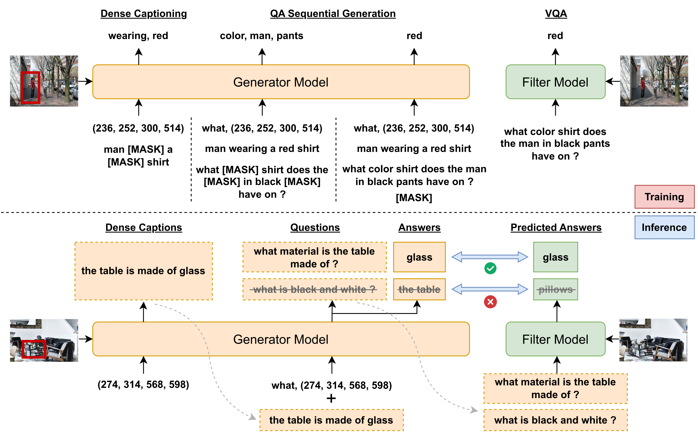

# Enhancing Vision-Language Pre-Training with Jointly Learned Questioner and Dense Captioner

Official PyTorch implementation of the paper "Enhancing Vision-Language Pre-Training with Jointly Learned Questioner and Dense Captioner" (accepted by ACM MM '23).

<div align="center">
  
</div>

- Full paper is available [here](https://arxiv.org/abs/2305.11769).
- The CC3M-QA-DC dataset is now available (See "Get Started").
- PyTorch implementation of "**J**oint Q**A** and **D**C G**E**neration (JADE)" is available. However, the current version will no longer be maintained. We are working on a new framework named [TorchSlime](https://github.com/SlimeAI/TorchSlime) (a new version of TorchSlime is coming soon) and are refactoring this project based on it. Please stay tuned. We will update this repository once everything is ready. Feel free to directly use the dataset before that.
- Model weights will be released (after we finish refactoring this project).

## Get Started

### CC3M-QA-DC Dataset

The text part of the CC3M-QA-DC dataset is available at [Google Drive](https://drive.google.com/file/d/17x6rnca7VHEsSWRkyaHOiwQYys2xfyYn/view?usp=share_link). There are total 89M QA pairs and 38M dense captions corresponding to 2.8M images in the dataset.

#### Dataset Format

The QA pairs and dense captions (DC) are stored separately in two folders using the JSON format. In each folder, each JSON file is named after the id of the corresponding CC3M image (see "How to Get the IDs of the Images").

- QA Dataset (Folder "QA")

Each JSON file contains an **array** of objects, and each object has the following data structure:

```JSON
{
  "question": "The question according to the image. [str].",
  "answer": "The answer. [str].",
  "prob": "The average token probability output by the model. [float].",
  "type": "Question type. [str] [what | how | where | who | why | when | binary].",
  "object": "Object region related to the question. [list[int, int, int, int]]. The 4 values are (x1, y1, x2, y2) coordinates of the bounding box. * Note that the values are linearly scaled between 0 and 224 according to the resolution of the image.",
  "region_description": "The dense caption related to the question. [str].",
  "img_id": "Image id. [str].",
  "question_id": "Question id. [int]."
}
```

- DC Dataset (Folder "DC")

Each JSON file contains an **array** of objects, and each object has the following data structure:

```JSON
{
  "object": "Object region. [list[int, int, int, int]].",
  "region_description": "The dense caption related to the object region. [str]."
}
```

#### How to Get the IDs of the Images

The image ids are computed based on the original image URLs, which is described as follows:

```Python
import zlib

# image url in the original CC3M dataset
url = 'https://www.xxxxx.com/foo/bar/baz.jpg'
img_id = zlib.crc32(url.encode('utf-8')) & 0xffffffff
```

### Joint QA and DC Generation (JADE)

We are still developing the [TorchSlime](https://github.com/SlimeAI/TorchSlime) framework and refactoring the project based on it. Please stay tuned!

## Citation

If you find this work useful for your research, you can cite the following paper:

```bibtex
@article{liu2023enhancing,
  title={Enhancing Vision-Language Pre-Training with Jointly Learned Questioner and Dense Captioner},
  author={Liu, Zikang and Chen, Sihan and Guo, Longteng and Li, Handong and He, Xingjian and Liu, Jing},
  journal={arXiv preprint arXiv:2305.11769},
  year={2023}
}
```
